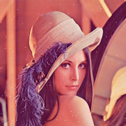
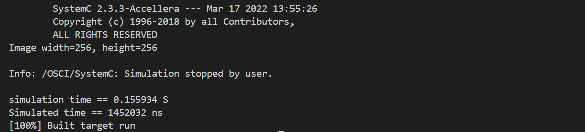
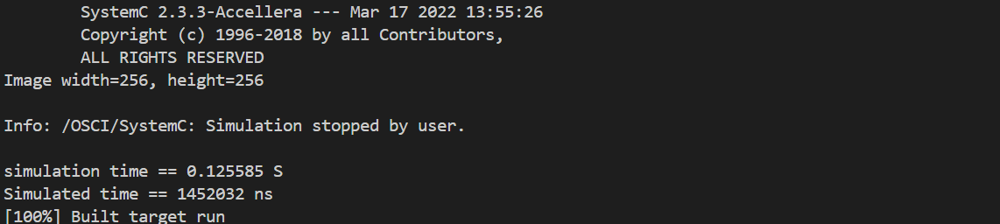
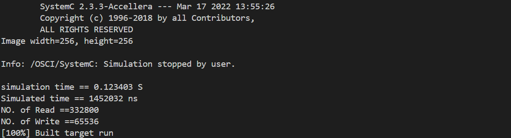

## **EE6470_ESL_HW2**
### <span style="font-family: '標楷體'; font-weight: lighter;">112062707 廖哲緯</span> 
## **Part 1**
### Requirment
(40 pt) Gaussian Blur Filter with TLM interface
* Please implement and wrap the filter module (the data buffer version) with TLM interface.
* Please insert delays with wait() in the target module.
* Please reuse codes in lab3 to write a testbench as a initiator to test the TLM module.
### Compile and Execute
```powershell
cd part1/sobel_fifo/
mkdir build
cd build
cmake ..
make run
```
### Implementation
main.cpp<br>
Create a initiator to help testbench to bind with sobel_filter
```cpp
tb.initiator.i_skt(sobel_filter.t_skt);
```
SobelFilter.cpp<br>
Using a 4 bits mask to check weather the r, g, b is enable or empty, and also use data array to transfer to R, G, B values
```cpp
case SOBEL_FILTER_R_ADDR:
    if (mask_ptr[0] == 0xff) {
    i_r.write(data_ptr[0]);  
    }
    if (mask_ptr[1] == 0xff) {
    i_g.write(data_ptr[1]);
    }
    if (mask_ptr[2] == 0xff) {
    i_b.write(data_ptr[2]);
    }
```
Also insert the delays with wait() in target module
```cpp
void SobelFilter::blocking_transport(...){
    ...
     delay = sc_time(1, SC_NS);
}
```
### Result
Use image "lena_color_256_noise.bmp" as input
- **Input image** 

- **Output image** 

- **Run time** 


## **Part 2**
### Requirment
(30 pt) Gaussian Blur Filter with quantum keeper
* Please setup a quantum keeper to reduce the wait() in the implementation.
* Does the quantum keeper version improves the simulation run time?
### Compile and Execute
```powershell
cd part2_qk_transport/sobel_fifo/
mkdir build
cd build
cmake ..
make run
```
### Implementation
Testbench.h<br>
Include the quantumkeeper library and declear m_qk
```cpp
#include "tlm_utils/tlm_quantumkeeper.h"
tlm_utils::tlm_quantumkeeper m_qk;
```
Initiator.cpp<br>
Set the global_quantum to 15ns and initialize.
```cpp
m_qk.set_global_quantum( sc_time(15, SC_NS) );
m_qk.reset();
```
Use m_qk.inc to storage local time and synchronize after 15ns
```cpp
m_qk.inc( dummyDelay );
if (m_qk.need_sync()) m_qk.sync();
```

### Result
Use image "lena_color_256_noise.bmp" as input
- **Input image** 

- **Output image** 

- **Run time** 

Conver to Part 1, we can realize that the quantumkeeper and can reduce the simulation time but the waiting time(simulated time) won't change.<br>
* Simulation time
(0.155934 -> 0.125585)

## **Part 3**
### Requirment
(30 pt) Gaussian Blur Filter with TLM interconnect
* Please connect the quantum keeper modules through a TLM bus.
* Please also insert counters in the transaction functions of TLM bus to count the number of read/write to the target module.
### Compile and Execute
```powershell
cd part3/sobel_fifo/
mkdir build
cd build
cmake ..
make run
```
### Implementation
main.cpp
Include the bus libary and declear the bus connection
```cpp
#include "SimpleBus.h".
#include "Initiator.cpp"
int sc_main(...){
    ...
    SimpleBus<1, 1> bus("bus");
    bus.set_clock_period(sc_time(CLOCK_PERIOD, SC_NS));
    tb.initiator.i_skt(bus.t_skt[0]);
    bus.setDecode(0, SOBEL_MM_BASE, SOBEL_MM_BASE + SOBEL_MM_SIZE - 1);
    bus.i_skt[0](sobel_filter.t_skt);
    ...
}
```
I also count the No. of read/write from/to target module(filter)<br>
Read count when filter_write_the_result_to_socket()<br>
Write count when initiator.write_to_socket(), because we use the data reuse method, so the No. of write to target module will be less than read. 
```cpp
unsigned int R_counter = 0;
unsigned int W_counter = 0;
R_counter++;
W_counter++;
```
### Result
Use image "lena_color_256_noise.bmp" as input
- **Input image** 

- **Output image** 

- **Run time** 

Conver to Part 1, we can realize that the quantumkeeper and can reduce the simulation time but the waiting time(simulated time) won't change.<br>
* Simulation time
(0.155934 -> 0.123403)
* No. of Read = 332800
* No. of Write = 65536